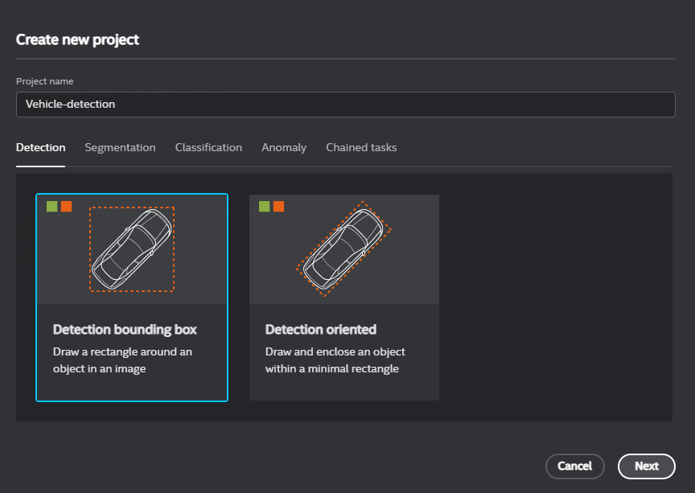
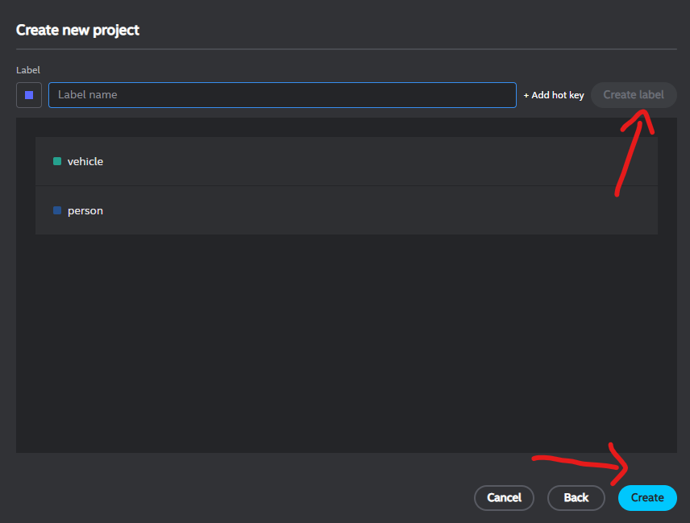
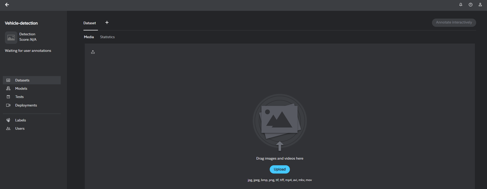
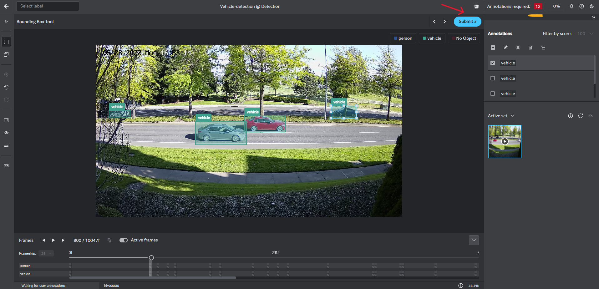
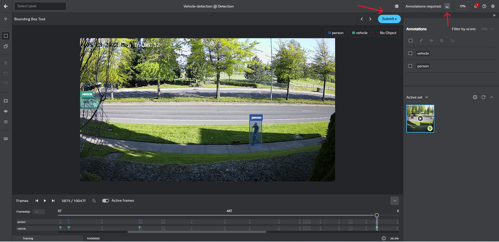
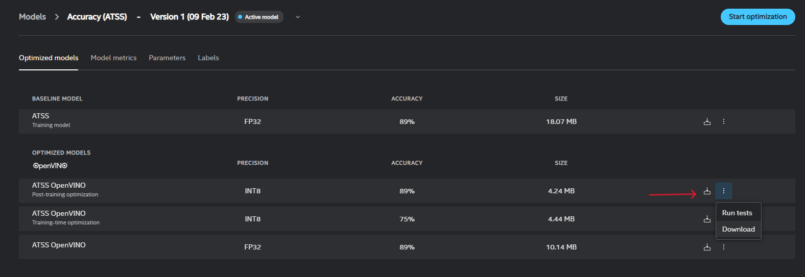
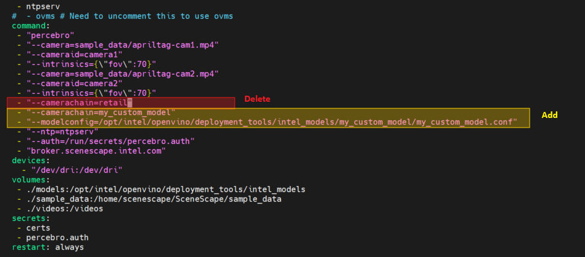

# How to Integrate Intel® Geti™ AI Models with Intel® SceneScape


This guide provides step-by-step instructions to train and integrate a custom AI model using the Intel® Geti™ platform with Intel® SceneScape. By completing this guide, you will:

- Train and export a custom AI model from Intel® Geti™.
- Integrate the model into the Intel® SceneScape pipeline.
- Validate inference results visually.

This task is important for deploying and validating custom vision models in production scenarios using Intel® SceneScape. If you’re new to Intel® Geti™, review [Intel® Geti™](https://geti.intel.com)

### Prerequisites

Before You Begin, ensure the following:

- **Dependencies Installed**: Docker, Docker Compose, and required Geti/SceneScape files.
- **Permissions**: Sufficient system access to configure files and run Docker containers.

This guide assumes familiarity with basic machine learning and Docker concepts. If needed, see:
- [Intel® Geti™ Platform Guide](https://geti.intel.com/platform)
- [OpenVINO™ Toolkit Overview](https://docs.openvino.ai/latest/index.html)

## Steps to Integrate Geti AI Models

1. **Train and Export the Model in Intel® Geti™**:
   - **Login to your Geti instance**
     
   - **Create a project in Geti for your use case. Example: Vehicle-detection**
     
   - **Create labels**: Add a label for each type of object, by filling in the text box and clicking Create label. Example: vehicle, person
     
   - **Upload the data set file/folder**: Upload .mp4 video file for vehicle-detection model training
     
   - **Start interactive annotation on your data**: Annotation of a minimum of 12 frames is required for model training. The default frame skip is 25. Continue to draw bounding boxes and label the objects (vehicle, person) until you are satisfied with the results and then click `Submit >>`
     
   - **Start model training**: After annotating all the frames, click on `...` beside Annotation required to begin with model training.
     
   - **Your pre-trained model is ready**
     
   - **Optimize model**: Intel® Geti™ builds a baseline model and an OpenVINO™ optimized model. You can improve the model performance using OpenVINO™ optimization techniques.
     
   - **Download the trained model**: Each trained model is exported from Intel® Geti™ as a zip archive that includes a simple demo to visualize the results of model inference. We will only utilize a few files from this archive.
     

   **Expected Output**:
   - `model.xml`, `model.bin`, and `config.json` under `model/`.

   **Structure of generated zip**:
   - model
     - `model.xml`
     - `model.bin`
     - `config.json`
   - python
     - model_wrappers (Optional)
       - `__init__.py`
       - model_wrappers required to run demo
     - `README.md`
     - `LICENSE`
     - `demo.py`
     - `requirements.txt`

2. **Prepare the Model Directory**:

   - Unzip and move the model files to `models/<your_model_name>/` inside Intel® SceneScape.
   - Create a config file: `models/<your_model_name>/<your_model_name>.conf`.

   ```json
   [
       {
           "model": "my_custom_model",
           "engine": "GetiDetector",
           "directory": "/opt/intel/openvino/deployment_tools/intel_models/my_custom_model",
           "categories": ["cart", "person"],
           "colorspace": "RGB"
       }
   ]
   ```

3. **Update `docker-compose.yml`**:

   Modify the video container:

   ```yaml
     - "--camerachain=my_custom_model"
     - "--modelconfig=/opt/intel/openvino/deployment_tools/intel_models/my_custom_model/my_custom_model.conf"
   ```
   

4. **Deploy Intel® SceneScape**:

   ```bash
   docker compose down --remove-orphans
   docker compose up -d
   ```

   Log into the Intel® SceneScape UI and verify that bounding boxes appear correctly.
   

## Alternate: Using Intel® Geti™ with OpenVINO™ Model Server (OVMS)

The OVMS has been integrated with Intel® SceneScape to run various OpenVINO™ Open Model Zoo models. Follow these steps to run Intel® Geti™ with OpenVINO™ Model Server:

1. **Place your Intel® Geti™ model** in `[PROJECT_DIR]/models/ovms`. Ensure the directory structure matches the [OpenVINO™ Model Server model layout](https://docs.openvino.ai/2022.2/ovms_docs_models_repository.html).

2. **Modify `docker-compose.yml`**:
   - Uncomment the `ovms` section.
   - Uncomment the `depends_on` for `ovms` in the `video` container.
   - Update the model's name to `my_custom_model=ovms`.

3. **Update Percebro Model Config**:

   In `percebro/model-config.json`, remove the `directory` attribute and add `external_id`:

   ```json
   {
     "model": "my_custom_model",
     "engine": "GetiDetector",
     "keep_aspect": 0,
     "categories": ["cart", "person"],
     "external_id": "my_custom_model"
   }
   ```

4. **Add Model Entry in `ovms-config.json`**:

   In `models/ovms-config.json`, add the following:

   ```json
   {
     "config": {
       "name": "my_custom_model",
       "base_path": "/models/my_custom_model",
       "shape": "auto",
       "batch_size": "1",
       "plugin_config": {
         "PERFORMANCE_HINT": "LATENCY"
       },
       "allow_cache": true
     }
   }
   ```

   > **Note**: Ensure the `name` matches the `external_id` in the model config.

5. **Launch Intel® SceneScape**:

   ```bash
   docker compose down --remove-orphans
   docker compose up -d
   ```

## Running YOLOv8 models with Intel® SceneScape detector

- Add the exported model into the Intel® SceneScape `models` directory.
- Create configuration file `my_custom_model.conf`, as shown in the [Intel® Geti™ models section](#how-to-integrate-intel-geti-ai-models-with-intel-scenescape).
- The exported model will contain a 'metadata.yaml' file, which lists the categories it can detect. Use the `"categories"` attribute to point to that file.
- The model might have been trained using RGB data. Use the `"colorspace"` attribute to specify if so.
- Verify the name of the xml file, and update accordingly. Note the engine must be set to `"YoloV8Detector"`:

*my_custom_model.conf* file example:

```json
[
    {
        "_optional_comment" : "Configuration notes",
        "model": "my_custom_model", "engine": "YoloV8Detector", "keep_aspect": 0,
        "directory": "/opt/intel/openvino/deployment_tools/intel_models/my_custom_model",
        "colorspace": "RGB",
        "xml": "my_custom_model.xml",
        "categories": "/opt/intel/openvino/deployment_tools/intel_models/my_custom_model/metadata.yaml"}
]
```

- Replace the default model and add the parameter `--modelconfig` in the video container of docker-compose.yml file as shown below.

```yaml
     - "--camerachain=my_custom_model"
     - "--modelconfig=/opt/intel/openvino/deployment_tools/intel_models/my_custom_model/my_custom_model.conf"
```

## Configuration Options

### Customizable Parameters

| Parameter     | Purpose                                   | Expected Values                    |
|---------------|-------------------------------------------|------------------------------------|
| `engine`      | Model engine for inference                | `GetiDetector`, `YoloV8Detector`   |
| `colorspace`  | Input image format                        | `RGB` or `BGR`                     |
| `categories`  | Detected classes                          | `Array of strings` or `.yaml` path |
| `xml`         | Specific .xml file name (YOLOv8 only)     | Filename string                    |

### Apply Configuration Changes

1. **Edit Config File**:
   Update your model configuration.

2. **Apply Changes**:

   ```bash
   docker compose down --remove-orphans
   docker compose up -d
   ```

## Troubleshooting

1. **Model not found**
   - **Cause**: OpenVINO™ Model Server throws a "model not found" exception if Percebro starts while the OVMS container is still loading the model config. This only happens when there are many models listed in ovms-config.json and the model that is in use is listed at the bottom
   - **Resolution**: Move your model to the top of `ovms-config.json`.

## Supporting Resources
- [Intel® Geti™ Platform](https://geti.intel.com/platform)
- [OpenVINO™ Model Server Docs](https://docs.openvino.ai/latest/ovms_what_is_openvino_model_server.html)
